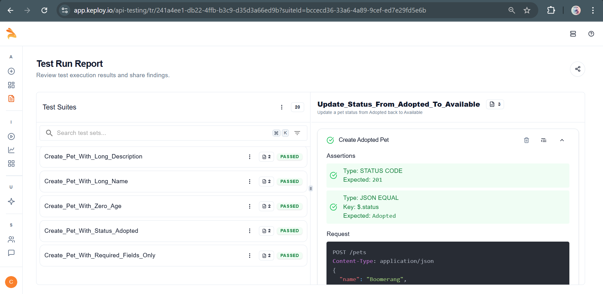

# 🐾 Pet Adoption Center API

A full-stack Pet Adoption Center application that allows users to add, view, update, and delete pets available for adoption. Now enhanced with **unit**, **integration**, and **API tests** with coverage reporting.

---

## 🧰 Tech Stack

- **Backend:** Node.js, Express.js
- **Frontend:** React.js
- **Database:** MongoDB Atlas (Cloud)
- **Testing Tools:**
  - Jest (Testing Framework)
  - Supertest (API Testing)
  - MongoMemoryServer (Mocked DB for integration tests)
- **API Testing:** Postman
- **AI API Testing:** [Keploy](https://keploy.io)
- **CI/CD:** GitHub Actions

---

## 📌 Features

- Add new pets for adoption
- View all available pets
- Edit pet details
- Delete pets
- Connected React frontend
- MongoDB Atlas integration
- Unit, Integration, and API test coverage
- Keploy AI test suite
- CI/CD automated testing pipeline
- `.env` environment config support

---

## 📡 API Endpoints

All routes are prefixed with: `http://localhost:5000/api/pets`

| Method | Endpoint            | Description               |
|--------|---------------------|---------------------------|
| POST   | `/api/pets`         | Add a new pet             |
| GET    | `/api/pets`         | Get all pets              |
| PUT    | `/api/pets/:id`     | Update pet by ID          |
| DELETE | `/api/pets/:id`     | Delete pet by ID          |


### ➕ `POST /api/pets`
Add a new pet.

**Request Body:**
```json
{
  "name": "Tommy",
  "age": 2,
  "breed": "Labrador",
  "description": "Friendly and playful",
  "image": "https://example.com/dog.jpg"
}
```

### 📥 `GET /api/pets`
Get all pets.

**Response:**
```json
[
  {
    "_id": "abcd1234",
    "name": "Tommy",
    "age": 2,
    "breed": "Labrador",
    "description": "Friendly and playful",
    "image": "https://example.com/dog.jpg"
  }
]
```

### ✏️ `PUT /api/pets/:id`
Update pet details.

**Request Body (same as POST):**  
Only include fields you want to update.

### ❌ `DELETE /api/pets/:id`
Delete a pet by its ID.

---

## 🛢️ Database Integration (MongoDB)

- MongoDB Atlas cloud database
- Connected using the official `mongoose` ODM
- Database URL stored in `.env`:

```env
PORT=5000
MONGO_URI=mongodb+srv://<username>:<password>@cluster0.mongodb.net/?retryWrites=true&w=majority
```

- Connection in `backend/server.js`:
```js
mongoose.connect(process.env.MONGO_URI)
```

---

## 📁 Folder Structure

```
pet-adoption-center/
│
├── backend/
│   ├── controllers/
│   ├── models/
│   ├── routes/
│   ├── tests/
│   │   ├── unit/
│   │   ├── integration/
│   │   └── api/
│   ├── server.js
│   └── .env
│
├── frontend/
└── README.md
```

---

# 🧪 Testing Overview


---

## 🧪 Keploy AI API Testing ✅

Keploy has been integrated for API testing using captured `curl` traffic and an OpenAPI schema.

### 📷 Keploy Test Report Screenshot



---

## 🔁 CI/CD Integration (GitHub Actions)

Keploy test suite runs automatically via **GitHub Actions** on every push.  
Tests run with your live API using `test-suite` mode in **Keploy Cloud**.

### ✅ CI/CD Workflow on GitHub

👉 [View Workflow Runs](https://github.com/NishantChaubey534/pet-adoption-center/actions)

---


### ✅ 1. Unit Tests (Jest)
- File: `tests/unit/petController.test.js`
- Coverage: **100%** on controller logic
- Uses mocking (`jest.mock`) for Mongoose

### ✅ 2. Integration Tests
- File: `tests/integration/petRoutes.test.js`
- Uses MongoMemoryServer for real DB interaction

### ✅ 3. API Tests
- File: `tests/api/petAPI.test.js`
- Uses Supertest to test endpoints (`POST`, `GET`, `PUT`, `DELETE`)

---

## 🧪 Sample Test Command

```bash
npm test
```

Test coverage is automatically calculated using Jest.

---

## 🧪 Test Coverage Report


---

## ▶️ Run the Backend

```bash
cd pet-adoption-center/backend
npm install
npm run dev
```

---

## 🌐 Run the Frontend

```bash
cd pet-adoption-center/frontend
npm install
npm start
```

---

## 🔁 API via Postman

- POST `/api/pets`
- GET `/api/pets`
- PUT `/api/pets/:id`
- DELETE `/api/pets/:id`

---

## 📸 UI Preview

- Add pet via form
- View all pets
- Edit/Delete from UI

---

## 🧪 Testing Tools

- Jest
- Supertest
- MongoMemoryServer
- keploy
- GitHub Actions

---

## 🙌 Contributing

PRs welcome to improve features or styling.

---

## 👨‍💻 Author

**Nishant Kumar Chaubey**  
_B.Tech | KIIT | Web & Blockchain Enthusiast_

---

## 📄 License

[MIT](LICENSE)
